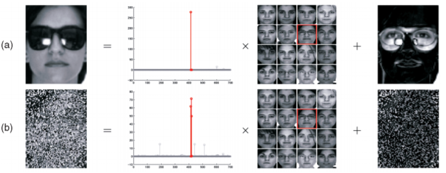

# Sparse Learning  
## [Home](../../README.md)
- The goal of this document is to provide a reading list in Sparse learning.

## Topics
- [Tasks](#tasks)
- [Papers](#papers)
- [Lab](#lab)
- [People](#people)
- [Datasets](#datasets)
- [Software](#software)
- [References](#references) 

## tasks
__Sparse representation based classification__ (SRC) seeks to represent the testing data with a sparse linear combination of training data. SRC assumes that, if sufficient training samples are available from each class, it is possible to represent each testing sample by a linear combination of a sparse subset of the training samples. The class label of the testing sample is assigned as the class with the minimum representation residual over all classes. 

})

[Topics](#topics)

## Papers
Paper list.

|No.  |Figure   |Title   |Authors  |Pub.  |Links|Datasets|
|-----|:-----:|:-----:|:-----:|:-----:|:---:|:---:|
|1||__Robust Face Recognition via Sparse Representation__|[John Wright](http://www.columbia.edu/~jw2966/), [Allen Y. Yang](https://people.eecs.berkeley.edu/~yang/), Arvind Ganesh, S. Shankar Sastry, and [Yi Ma](http://yima.csl.illinois.edu/)|__[PAMI 2009](http://ieeexplore.ieee.org/xpl/RecentIssue.jsp?punumber=34)__|[PDF](http://www.columbia.edu/~jw2966/papers/WYGSM09-PAMI.pdf)   [PPT](http://www.cmlab.csie.ntu.edu.tw/~known/known200611/slides/%5B200810%5DRobust%20Face%20Recognition%20via%20Sparse%20Representation-zz.pdf)   [Home](http://perception.csl.illinois.edu/recognition/Home.html)| |

[Topics](#topics)

## Lab

[Topics](#topics)

## People

[Topics](#topics)

## Datasets

[Topics](#topics)

## Software

[Topics](#topics)

## References

[Topics](#topics)

[Latex formula](http://latex.codecogs.com/)